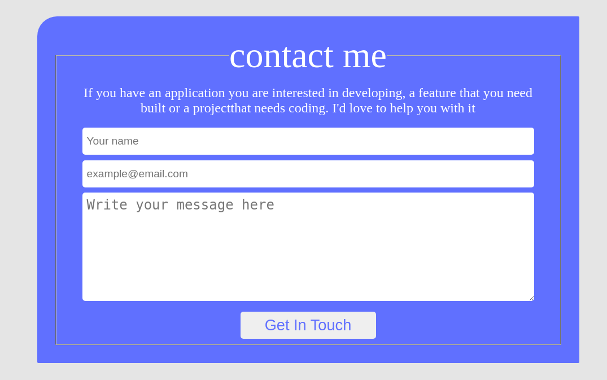

# curriculum-cr-training-contact-form

> This repo host an initial code for the tasks performed during the Code Reviewers training.

Application is based on this [Figma design](https://www.figma.com/file/t3EJUCAEViw3QasuJLPLVT/Microverse-Student-Potfolio-Templates-Main?node-id=1%3A1471).

This project is just for practicing purposes.

## Built With

- HTML5
- CSS3
- Git and Github

## Live Demo

Coming soon !

## Getting Started

- Open your terminal,
- Cd  into the directly where you want to run the project,
- Run this command to clone the project locally: `git clone git@github.com:Mihndim2020/curriculum-cr-training-contact-form.git`,
- Cd into Hello Microverse and enter `code .` to open the project in VS code,
- Open index.html file, right click on it and take open life server to run the project.

### Prerequisites
- You need VS code of any code editor and a browser

## Author

👤 **Mih Julius**

- Github: [@Mihndim2020](https://github.com/Mihndim2020)
- Twitter: [@mihndim](https://github.com/mih-julius)
- Linkedin: [Mih Julius](https://www.linkedin.com/mih-julius)

## 🤝 Contributing

Contributions, issues, and feature requests are welcome!

Feel free to check the [issues page](../../issues/).

## Show your support

Give a ⭐️ if you like this project!

## Acknowledgments

- Hat tip to anyone whose code was used
- Inspiration
- etc

## 📝 License

This project is [MIT](./MIT.md) licensed.
